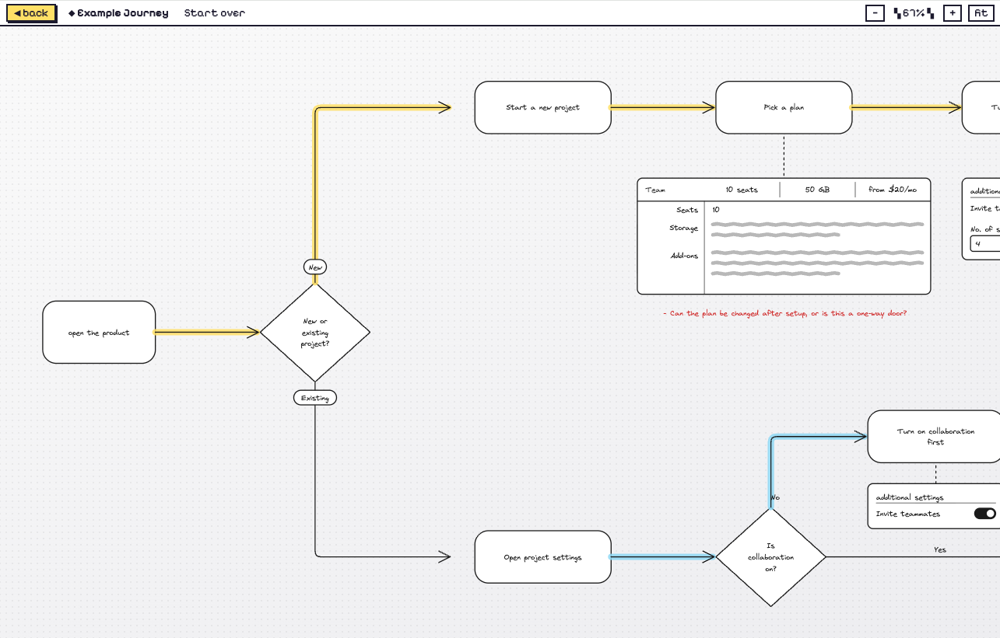

# user-journey-kit

Write your user flow as a list of steps. Get back an interactive, hand-drawn
journey diagram you can walk one step at a time in the browser.



Using it is simple:

1. Write steps in the text editor or Docs. Markdown is preferred.
2. Tell Claude to:

   ```
   Use https://github.com/allisonmui9/user-journey-kit to create a user journey following these steps. Do not invent your own styles or instructions:
   ```

3. Make any revisions. Add open questions or instructions to drawing visuals to help illustrate your ideas.

The outcome is an interactive user journey diagram that helps you collaborate with your stakeholders — aligning on the right user flow and surfacing open questions at each step. You can also ask to illustrate visuals, which are automatically rendered in a scribble style to keep the conversation focused on ideas rather than pixel-perfect details. It's retro-styled, because why not?!

## Prerequisite

You need **Node.js** first; the prototype is a small web app and can't start
without it. Grab the LTS build from [nodejs.org](https://nodejs.org), then
confirm:

```bash
node -v
```

## Tips on writing steps that read cleanly

A nested list is enough. Forks, decisions, and convergence all come through if
you write them plainly:

```
1. Navigate to the app
2. New project or existing? (fork)
3. New project
   1. Name it
   2. Pick a template
   3. Create
4. Existing project
   1. Open the list
   2. Is it archived? (decision)
      1. No → open it
      2. Yes → unarchive first, then open
```

Full guidance, including how to describe a screen so it gets sketched beneath a
step: [writing-the-doc.md](../.claude/skills/user-journey/references/writing-the-doc.md).

Two rules the skill holds to deliberately: it won't invent screen sketches you
didn't describe, and it won't write open questions you didn't ask. A journey of
bare boxes is a correct journey if that's what your steps said.

## What's in here

```
.claude/skills/user-journey/
  SKILL.md                     the workflow Claude follows
  references/
    writing-the-doc.md         how to write the steps
    components.md              the sketch kit: shapes and annotations
  assets/template/             the Vite + React app Claude copies per journey
    src/journey/types.ts       the Journey data shape
    src/journey/layout.ts      all positioning, computed from the data
    src/components/flow/       hand-drawn nodes, arrows, scribbled UI
    src/pages/JourneyPage.tsx  the step-by-step walkthrough renderer
```

Positions are never hand-placed — `layout.ts` derives every coordinate from the
journey data, so adding a step can't break the spacing.
